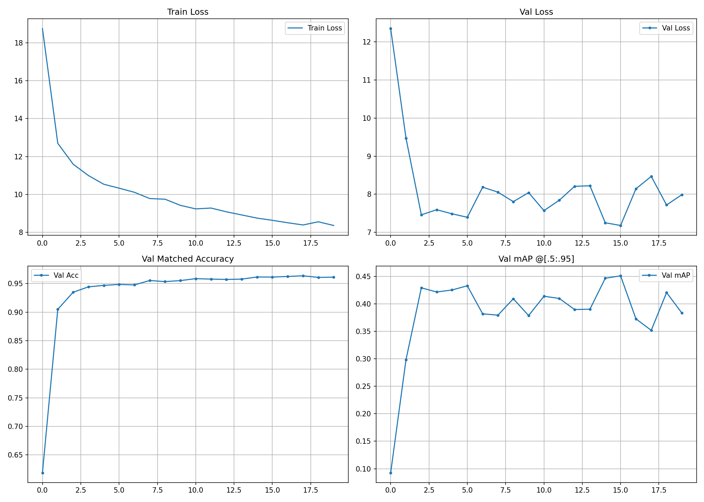
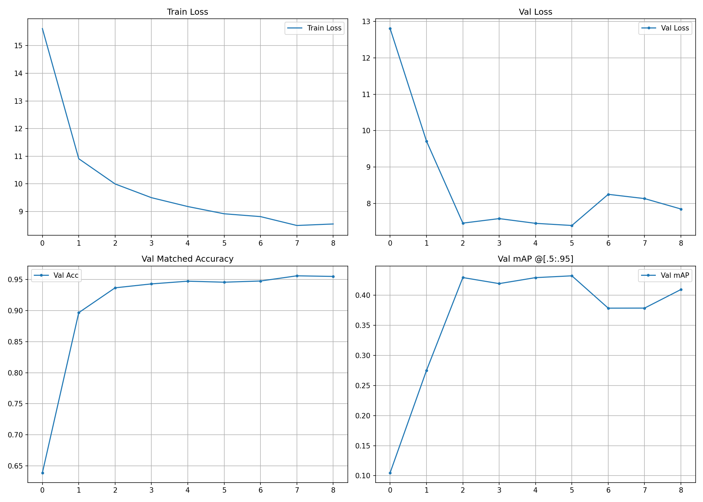
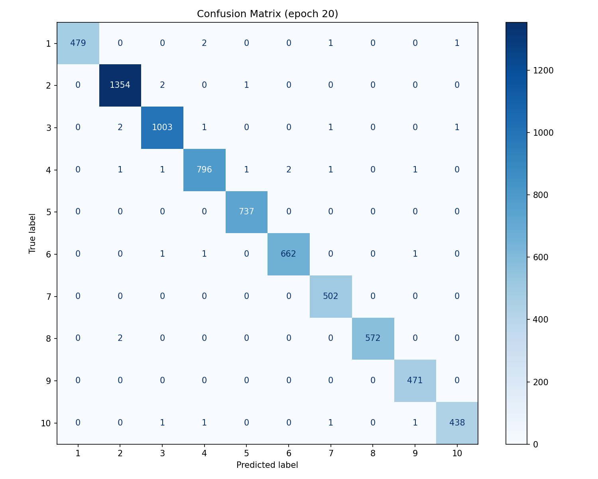

# NYCU Deep Learning HW2 — Digit Detection with Deformable DETR

## Leaderboard Result

| Rank | Student ID | Submission Time | Predictions | ID | mAP |
|------|------------|----------------|-------------|-----|-----|
| 33 | 314552047 | 2026-04-21 08:48 | 689221 | 314552047 | **0.38** |


---

## Task Overview

Detect and classify digits **0–9** in street-view images using an end-to-end object detector.  
- Input: RGB images (varying sizes)  
- Output: bounding boxes + digit class labels (COCO format JSON)  
- Metric: mAP @ [0.5:0.95]

---

## Method

### Model: Deformable DETR + DN Training

- **Backbone**: ResNet-50 (ImageNet pre-trained, frozen BN)
- **Neck**: 4-level FPN (C3, C4, C5, C5-stride2)
- **Encoder/Decoder**: 6 layers each, 8 attention heads, 100 object queries
- **DN Training**: 5 noisy copies per GT box (label noise 0.2, box noise 0.4)
- **EMA**: decay = 0.9997

### Key Improvements over Baseline

| Component | Baseline | Ours |
|-----------|----------|------|
| DN Training | ❌ | ✅ |
| MixUp | ❌ | ✅ (p=0.3) |
| Horizontal Flip | ❌ | ✅ (p=0.5) |
| Mosaic prob | 0.5 | 0.6 |
| loss_bbox / loss_giou | 5.0 / 2.0 | **6.0 / 3.0** |
| eos_coef | 0.1 | **0.05** |
| num_queries | 75 | **100** |
| Color jitter | (0.3,0.3,0.25,0.05) | (0.4,0.4,0.3,0.1) |

---

## Training Curves

### With DN Training (dn_number=5)



> Train loss starts higher (~18.5) due to extra DN loss terms but drops sharply. Val loss stabilises around **7.5** by epoch 20.

### Without DN Training (Baseline)



> Val loss at epoch 20 is ~**10.0**, noticeably slower convergence compared to DN variant.

### Comparison Summary

| Setting | Val Loss @ ep20 | Convergence |
|---------|----------------|-------------|
| Baseline (no DN) | ~10.0 | Slow |
| + DN Training | ~7.5 | **Fast** ✅ |

---

## Confusion Matrix

### With DN Training



### Without DN Training (Baseline)


> Common confusion patterns: **1↔7** (similar vertical stroke), **6↔9** (rotation ambiguity), **0↔8** (similar oval shape).

---

## Hyperparameters

```
img_size       : 512
num_queries    : 100
hidden_dim     : 256
enc/dec layers : 6 / 6
n_levels (FPN) : 4
batch_size     : 8
epochs         : 80
lr             : 1e-4  (backbone: 1e-5)
weight_decay   : 1e-4
loss_bbox      : 6.0
loss_giou      : 3.0
eos_coef       : 0.05
dn_number      : 5
mosaic_p       : 0.6
mixup_p        : 0.3
multi_scale    : [448, 480, 512, 544, 576]
```

---

## How to Run

### Training

```bash
# With DN Training (recommended)
PYTORCH_CUDA_ALLOC_CONF=expandable_segments:True \
python train_predict.py \
  --do_train \
  --use_dn \
  --device cuda:1 \
  --img_size 512 \
  --n_levels 4 \
  --batch_size 8 \
  --output_dir ./output_v2

# Baseline (no DN)
python detr_ablation.py \
  --do_train \
  --device cuda:1 \
  --batch_size 8 \
  --output_dir ./exp_no_dn \
  --epochs 20
```

### Inference

```bash
python train_v2.py \
  --do_infer \
  --resume ./output_v2/best.pth \
  --device cuda:1 \
  --img_size 512 \
  --n_levels 4 \
  --output_dir ./output_v2 \
  --pred_file pred.json
```

---

## File Structure

```
.
├── train_v2.py          # Improved model (DN + MixUp + HFlip)
├── detr_ablation.py     # Baseline for ablation study
├── train.json           # COCO-format training annotations
├── valid.json           # COCO-format validation annotations
├── train/               # Training images
├── valid/               # Validation images
├── test/                # Test images
└── output_v2/
    ├── best.pth         # Best checkpoint (by val mAP)
    ├── latest.pth       # Latest checkpoint
    ├── pred.json        # Inference predictions
    └── curves.png       # Training curves
```

---

## References

1. Zhu et al., *Deformable DETR*, ICLR 2021. [arXiv:2010.04159](https://arxiv.org/abs/2010.04159)
2. Carion et al., *DETR*, ECCV 2020. [arXiv:2005.12872](https://arxiv.org/abs/2005.12872)
3. Li et al., *DN-DETR*, CVPR 2022. [arXiv:2203.01305](https://arxiv.org/abs/2203.01305)
4. Bochkovskiy et al., *YOLOv4*, arXiv 2020. [arXiv:2004.10934](https://arxiv.org/abs/2004.10934)
5. Zhang et al., *MixUp*, ICLR 2018. [arXiv:1710.09412](https://arxiv.org/abs/1710.09412)
